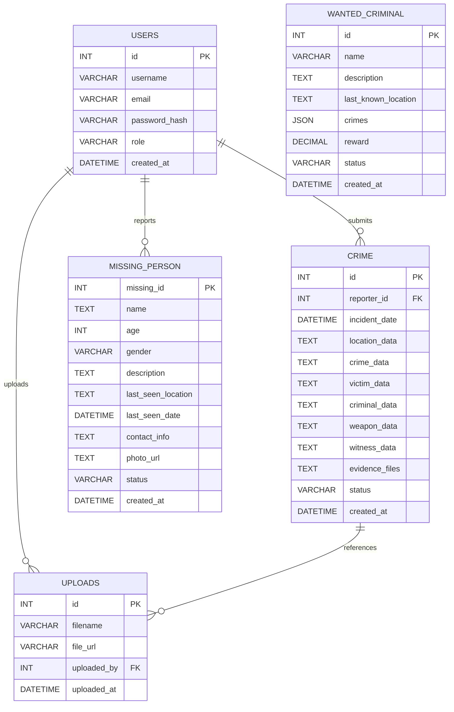

# My Safety — Project Report

## Introduction
"My Safety" is a full‑stack web application for reporting and tracking public safety incidents: crimes, missing persons, wanted criminals, and related evidence. The system provides a simple frontend for citizens to submit reports (with optional files), and a FastAPI backend that stores reports in a MySQL database and serves static pages/APIs.

## Motivation
- Provide a low‑friction channel for citizens to report incidents.
- Centralize incident data for easier triage by authorities.
- Allow attachments (photos, evidence) and structured data to improve investigations.
- Build a lightweight, extensible prototype that can be deployed locally or on a private server.

## Objectives
- Implement secure endpoints for submitting reports and uploading evidence.
- Store structured report data and uploaded file references in a relational database.
- Provide a responsive frontend with country‑specific defaults (e.g., Bangladesh districts).
- Deliver clear server logging and helpful client‑side diagnostics to aid debugging.
- Keep the system modular to allow easy future improvements (auth, analytics, notifications).

## Main Features
- Report types: Crime reports, Missing person reports, Wanted criminals, Emergency alerts.
- File uploads endpoint for evidence (images/documents). Files saved under `static/uploads/`.
- Form-driven frontend pages that validate input, upload evidence, then POST JSON payloads to backend APIs.
- Database persistence for all reports; flexible insert logic to accommodate DB schema differences.
- CORS enabled for development; static file serving for frontend pages.

## Database ER and Schema Diagram

Mermaid ER diagram (renderable where mermaid is supported):



Notes
- Many fields (location_data, crime_data, evidence_files) are stored as JSON/text blobs to preserve the flexible structure collected from the frontend.
- Foreign keys (reporter_id, uploaded_by) link to a minimal USERS table.

## SQL Codes (DDL & DML)

DDL — create tables (MySQL compatible). Adjust types if your MySQL version supports JSON (you can change TEXT → JSON).

```sql
-- Users table
CREATE TABLE IF NOT EXISTS users (
  id INT AUTO_INCREMENT PRIMARY KEY,
  username VARCHAR(128),
  email VARCHAR(255) UNIQUE,
  password_hash VARCHAR(255),
  role VARCHAR(50) DEFAULT 'user',
  created_at DATETIME NOT NULL DEFAULT CURRENT_TIMESTAMP
) ENGINE=InnoDB DEFAULT CHARSET=utf8mb4;

-- Uploads (evidence) table
CREATE TABLE IF NOT EXISTS uploads (
  id INT AUTO_INCREMENT PRIMARY KEY,
  filename VARCHAR(512) NOT NULL,
  file_url VARCHAR(1024) NOT NULL,
  uploaded_by INT NULL,
  uploaded_at DATETIME NOT NULL DEFAULT CURRENT_TIMESTAMP,
  FOREIGN KEY (uploaded_by) REFERENCES users(id) ON DELETE SET NULL
) ENGINE=InnoDB DEFAULT CHARSET=utf8mb4;

-- Crime reports
CREATE TABLE IF NOT EXISTS crime (
  id INT AUTO_INCREMENT PRIMARY KEY,
  reporter_id INT NULL,
  incident_date DATETIME NULL,
  location_data TEXT,
  crime_data TEXT,
  victim_data TEXT,
  criminal_data TEXT,
  weapon_data TEXT,
  witness_data TEXT,
  evidence_files TEXT,
  status VARCHAR(64) NOT NULL DEFAULT 'Pending',
  created_at DATETIME NOT NULL DEFAULT CURRENT_TIMESTAMP,
  updated_at DATETIME NULL,
  FOREIGN KEY (reporter_id) REFERENCES users(id) ON DELETE SET NULL
) ENGINE=InnoDB DEFAULT CHARSET=utf8mb4;

-- Missing persons
CREATE TABLE IF NOT EXISTS missing_person (
  missing_id INT AUTO_INCREMENT PRIMARY KEY,
  name TEXT NOT NULL,
  nickname VARCHAR(255),
  hometown VARCHAR(255),
  age INT NULL,
  weight FLOAT NULL,
  hair_color VARCHAR(64),
  photo_url TEXT,
  last_seen_date DATETIME NULL,
  last_seen_location TEXT,
  description TEXT,
  medical_needs TEXT,
  reporter_name VARCHAR(255),
  reporter_phone VARCHAR(64),
  reporter_email VARCHAR(255),
  reporter_relation VARCHAR(128),
  status VARCHAR(64) DEFAULT 'Reported',
  created_at DATETIME NOT NULL DEFAULT CURRENT_TIMESTAMP
) ENGINE=InnoDB DEFAULT CHARSET=utf8mb4;

-- Wanted criminals
CREATE TABLE IF NOT EXISTS wanted_criminal (
  id INT AUTO_INCREMENT PRIMARY KEY,
  name VARCHAR(255) NOT NULL,
  alias VARCHAR(255),
  description TEXT,
  last_known_location TEXT,
  crimes TEXT,
  reward DECIMAL(12,2) DEFAULT 0,
  danger_level VARCHAR(64),
  photo_url TEXT,
  status VARCHAR(64) DEFAULT 'Active',
  created_at DATETIME NOT NULL DEFAULT CURRENT_TIMESTAMP
) ENGINE=InnoDB DEFAULT CHARSET=utf8mb4;
```

DML — sample inserts to validate the schema:

```sql
INSERT INTO users (username, email, password_hash) VALUES
('tester','tester@example.com','<hashed_pw>');

INSERT INTO uploads (filename, file_url, uploaded_by) VALUES
('evidence1.jpg','/static/uploads/evidence1.jpg', 1);

INSERT INTO crime (reporter_id, incident_date, location_data, crime_data, victim_data, evidence_files, status)
VALUES (
  1,
  '2025-10-11 10:25:00',
  '{"district":"Dhaka","area":"Mirpur","city":"Dhaka"}',
  '{"type":"Robbery","description":"Stolen phone near market"}',
  '{"name":"John Doe","phone":"019..."}',
  '[{"filename":"evidence1.jpg","url":"/static/uploads/evidence1.jpg"}]',
  'Pending'
);

INSERT INTO missing_person (name, nickname, hometown, age, photo_url, last_seen_location, description, reporter_name, reporter_phone)
VALUES ('Musfique Ahmed','Mushfiq','Dhaka',24,'/static/contents/musfique.jpg','Mirpur Market','Wearing black jacket','Reporter Name','01961905838');

INSERT INTO wanted_criminal (name, alias, description, last_known_location, crimes, reward) VALUES
('Rafiq Hasan','Rafi','Suspected in multiple robberies','Banani, Dhaka','Robbery,Extortion',50000);
```

## Future Works
- Authentication & Authorization: implement JWT auth, user roles (citizen, officer, admin), session management.
- Input validation & rate limiting to prevent spam and malicious uploads.
- Admin dashboard: view and manage incoming reports, assign cases to officers.
- Notifications & alerts: SMS/email push to relevant agencies for high‑severity incidents.
- Geospatial features: integrate map visualization, geofencing, heatmaps for incident clusters.
- Improved evidence handling: virus scanning, file size/type restrictions, CDN storage (S3).
- Analytics: dashboards for crime trends, exportable reports.
- Mobile app: native or PWA client for faster reporting and location access.

## Conclusion
The My Safety project provides a functional prototype for citizen reporting with file attachments, a RESTful backend, and a relational database. The design favors flexibility (JSON/text fields) to accommodate evolving frontend data needs. With planned features (auth, dashboard, analytics), the system can evolve into a production‑grade public safety tool.

---

Appendix: Helpful commands
- Run backend (development):
  - uvicorn main:app --reload --host 0.0.0.0 --port 8000
- View MySQL (XAMPP) → phpMyAdmin → import/run DDL SQL above.
- Static uploads directory: `static/uploads/` (ensure writable by the server).